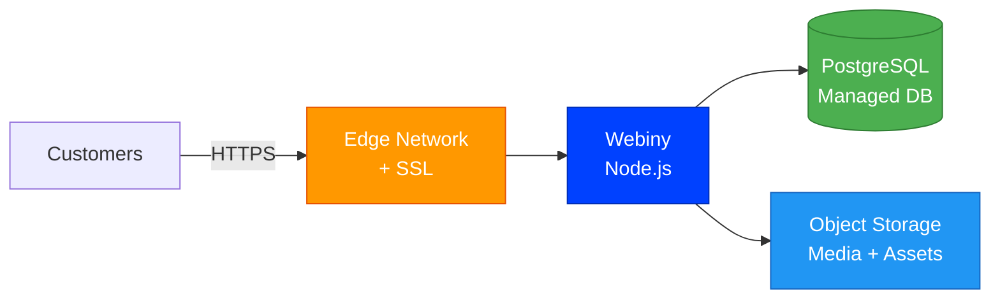
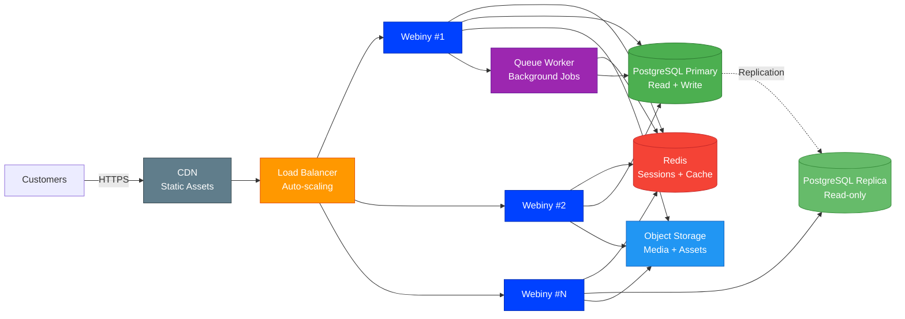

# Webiny    

An open-source serverless headless CMS with page builder, file manager, form builder, and a plugin-based architecture.

> **Credits**: Built on [Webiny](https://webiny.com) by [Webiny](https://github.com/webiny). All trademarks belong to their respective owners.

## Local Development

See [Webiny docs](https://www.webiny.com/docs) for setup. Webiny typically deploys to AWS but can run locally for development.

## Deploy on StackBlaze

This template includes a `stackblaze.yaml` for one-click deployment on [StackBlaze](https://stackblaze.com). Both options run on **Kubernetes** for reliability and scalability.

<strong>Standard Deployment</strong> — Single-instance Kubernetes setup for startups and moderate traffic

 

**What you get:**
- Single Webiny instance on Kubernetes
- Managed PostgreSQL database
- Automatic SSL/TLS via StackBlaze edge network
- Object storage for media and assets
- Automated daily backups
- Zero-downtime deploys

**Best for:** Development, staging, and moderate-traffic production environments.

<strong>High Availability Deployment</strong> — Multi-instance Kubernetes setup for business-critical production

 

**What you get:**
- Auto-scaling Webiny pods on Kubernetes behind a load balancer
- Redis for shared sessions, cache, and queue management
- PostgreSQL primary + read replica for high throughput
- CDN for static assets (images, CSS, JS)
- Background queue workers for async processing
- Shared object storage across all instances
- Automated failover and self-healing
- Zero-downtime rolling deploys

**Best for:** Production workloads, high-traffic applications, business-critical deployments.

---

### Maintained by [StackBlaze](https://stackblaze.com)

Weekly automated checks for up-to-date dependencies, security scanning, and best practices.

---

## Security

### Required environment variables

Before running in any shared or production environment, set the following variables (copy `.env.example` to `.env`):

| Variable | Description |
|---|---|
| `POSTGRES_PASSWORD` | **Required.** PostgreSQL password — must be changed from the default. |
| `POSTGRES_USER` | PostgreSQL username (default: `webiny`). |
| `POSTGRES_DB` | PostgreSQL database name (default: `webiny`). |

> **Warning:** The default `docker-compose.yml` will refuse to start unless `POSTGRES_PASSWORD` is set in your environment or a `.env` file. Do not use the placeholder value from `.env.example` in production.

### Insecure defaults to change before production

- **Database password**: the `.env.example` placeholder (`change_me_before_running`) is not a valid secret — replace it with a strong, randomly generated password.
- **`NODE_ENV`**: the Docker image sets `NODE_ENV=production`. Do not override this to `development` in production deployments.

